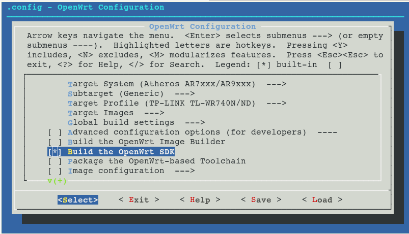

# OpenWRT Development
It is a simple document to help you develop simple applications on OpenWRT/LEDE. Some routers do not support enough space to compile the applications directly. Thus we will need to cross compile the applications locally.

1. Build SDK for the target router.  
2. Configure SDK environment for building your own package.
3. Create your own package.

## 1. Build SDK for the target router
* Prerequisites:
1. First, you will need to check your router information on OpenWRT website. E.g., you can find the information for [TP-Link AC1750][link1].
2. Use your router **Model** and **Version** to find **Target**.
3. You can refer the [OpenWRT instruction][link2] to install the required dependencies and git the source code.
```
git clone https://git.openwrt.org/openwrt/openwrt.git
cd openwrt
./scripts/feeds update -a
./scripts/feeds install -a
```
4. Configure the SDK you want to build.
```
make menuconfig
```
It will pop a menu shown above.


We need to configure **Target System** (according to **Target**), **Subtarget**, and **Target Profile**. 

**Remember, you need to select the option "Build the OpenWRT SDK"!**

5. Finally, run `make`.
It will start to build SDK. After succesefully building the SDK, you can find it in the path `./bin/targets/(Target System)/(Subtarget)/`. 
6. Unzip the folder to another place and next we can work on it.


## 2. Configure SDK environment for building your own package.

1. Enter the unzipped folder from Step 1.
   
2. Update the list of libraries and install the prepared libraries. We use `libopenssl` as an example. 
```
./scripts/feeds update -a
./scripts/feeds install libopenssl
```
Once the libraries are installed, we can use them when building own application.

## 3. Create your own package. 

1. First of all, you need to check the correctness of the source code used for the Cross-compilation.
2. In the root path of your SDK, enter the folder **Package**. Create a folder for the application. E.g., one of our project is SecWIR. Create a folder "SecWIR".
3.  In the folder "SecWIR", create a makefile "Makefile" and a folder "src". Put the source code of the application in the folder "src".
4.  Once Step 3 is finished, the source code should be in `(path to SDK)/package/SecWIR/src/`. Then, we will write "Makefile" in "SecWIR" for compile the code.
5. The following is an template Makefile of SecWIR.

```make - Makefile
include $(TOPDIR)/rules.mk

# Name, version and release number
# The name and version of your package are used to define the variable to point to the build directory of your package: $(PKG_BUILD_DIR)
PKG_NAME:=SecWIR
PKG_VERSION:=1.0
PKG_RELEASE:=1

# Source settings (i.e. where to find the source codes)
# This is a custom variable, used below
#SOURCE_DIR:=/home/buildbot/helloworld
PKG_BUILD_DIR:= $(BUILD_DIR)/$(PKG_NAME)

TARGET_CFLAGS += -pthread
TARGET_LDFLAGS += -lssl -lcrypto -D_GNU_SOURCE

#CONFIGURE_ARGS += \
#    --with-openssl=internal \

include $(INCLUDE_DIR)/package.mk

# Package definition; instructs on how and where our package will appear in the overall configuration menu ('make menuconfig')
define Package/SecWIR
	SECTION:=examples
	CATEGORY:=Examples
	TITLE:=SecWIR
	DEPENDS:=+libopenssl +libpthread
endef

# Package description; a more verbose description on what our package does
define Package/SecWIR/description
	Our SecWIR.
endef

# Package preparation instructions; create the build directory and copy the source code. 
# The last command is necessary to ensure our preparation instructions remain compatible with the patching system.
define Build/Prepare
		mkdir -p $(PKG_BUILD_DIR)
		cp ./src/* $(PKG_BUILD_DIR)
endef


define Build/Compile
		$(TARGET_CC) $(TARGET_CFLAGS) -o $(PKG_BUILD_DIR)/SecWIR.o -c $(PKG_BUILD_DIR)/SecWIR.c
		$(TARGET_CC) $(TARGET_LDFLAGS) -o $(PKG_BUILD_DIR)/$1 $(PKG_BUILD_DIR)/SecWIR.o
endef

# Package build instructions; invoke the target-specific compiler to first compile the source file, and then to link the file into the final executable
#define Build/Compile
#        $(TARGET_CC) $(TARGET_CFLAGS) -o $(PKG_BUILD_DIR)/HelloWorld.o -c $(PKG_BUILD_DIR)/HelloWorld.c
#        $(TARGET_CC) $(TARGET_LDFLAGS) -o $(PKG_BUILD_DIR)/$1 $(PKG_BUILD_DIR)/HelloWorld.o
#endef

# Package install instructions; create a directory inside the package to hold our executable, and then copy the executable we built previously into the folder
define Package/SecWIR/install
		$(INSTALL_DIR) $(1)/bin
		$(INSTALL_BIN) $(PKG_BUILD_DIR)/SecWIR $(1)/bin
endef

# This command is always the last, it uses the definitions and variables we give above in order to get the job done
$(eval $(call BuildPackage,SecWIR))
```
6. `make` will cost too much time since it will re-compile the whole SDK. We then use `make package/SecWIR/compile V=99` to compile our application itself.
7. If it compiles successfully, the package can be found in the path `./bin/package/(target)/.../xxx.ipk`
8. Copy the file xxx.ipk to the router. Use `opkg install xxx.ipk` or `opkg remove xxx` to install and remove the package. 


[link1]: https://openwrt.org/toh/tp-link/archer-c7-1750
[link2]: https://openwrt.org/docs/guide-developer/quickstart-build-images